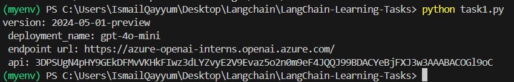
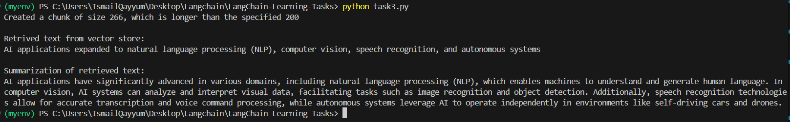
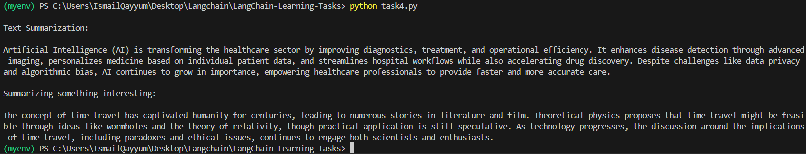
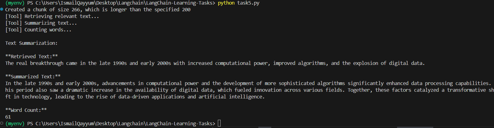
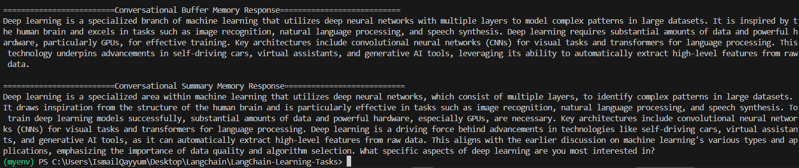
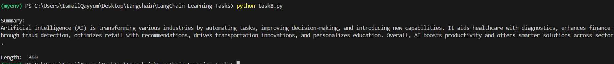
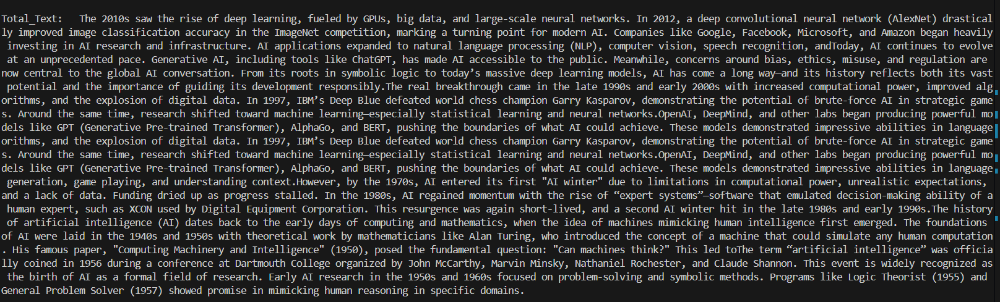
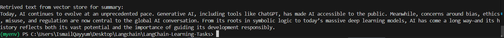

# LangChain Summarization Project

A project to master LangChain through structured tasks.

### Contributor: - Ismail Qayyum

## Task 1: Setup LangChain Environment

--- censored

# Task 2: Building a Basic Summarization Chain

# Task 3: Exploring Retrievers with Summarization

# Task 4: Creating an Agent for Summarization

# Task 5: Combining Chains, Retrievers, and Agents

# Task 6: Using Memory to Improve Summarization

# Task 7: Leveraging Document Loaders for Diverse Sources

# Task 8: Customizing with output parser

# Task 9: Experimenting with MultiQuery Retrieval

